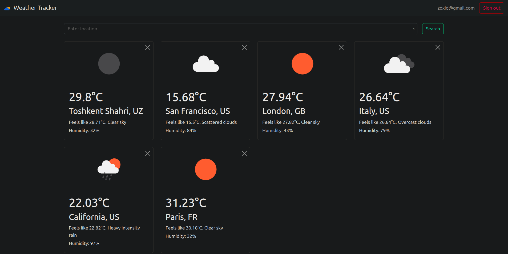
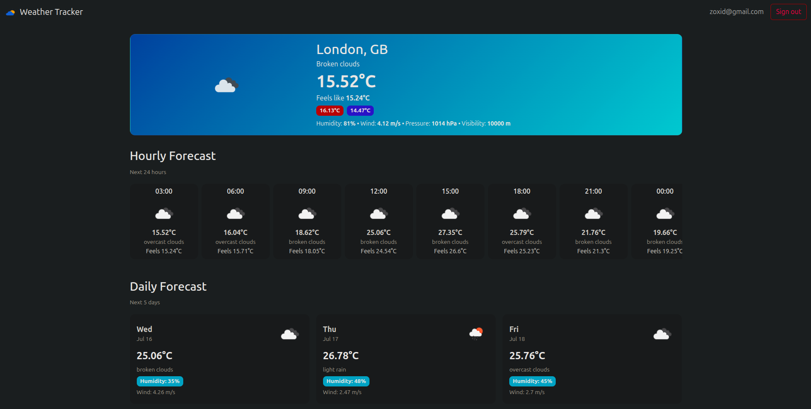
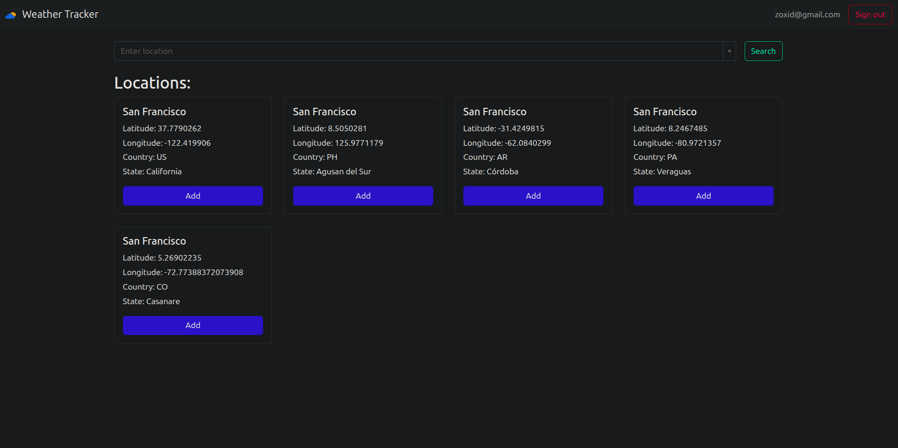
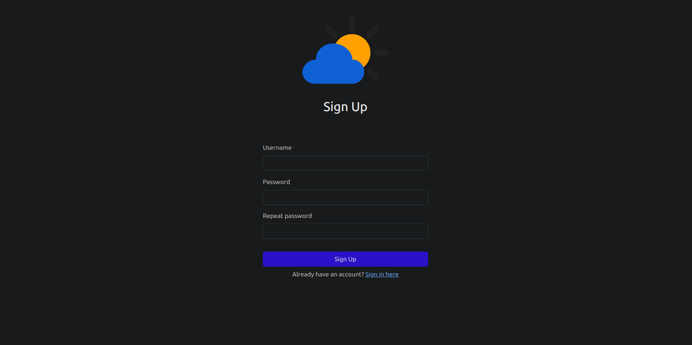
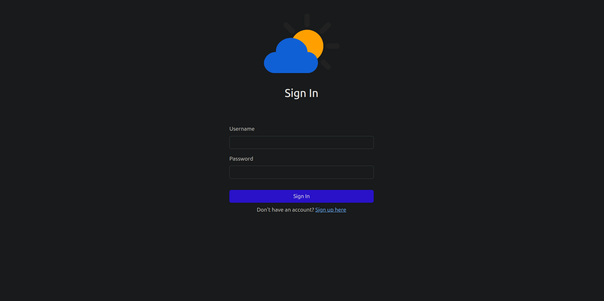

# 🌦️ Weather Tracker - Веб-приложение для просмотра погоды

[](https://www.java.com/)
[](https://spring.io/projects/spring-boot)
[](https://getbootstrap.com/)
[](https://www.postgresql.org/)

Веб-приложение для просмотра текущей погоды.  
Пользователь может зарегистрироваться и добавить в коллекцию одну или несколько локаций (городов, сёл, других пунктов), после чего главная страница приложения отображает список локаций с их текущей погодой.

---

## 🛠 Технологии и зависимости

### Backend
- Java 21
- Spring Boot 3.5
- Spring Security
- Spring Data JPA
- Spring Validation
- Spring Web
- Spring WebFlux (для API вызовов)
- Thymeleaf + Thymeleaf Extras Spring Security
- PostgreSQL
- Liquibase
- Lombok

### Frontend
- Thymeleaf
- Bootstrap 5.3
- OpenWeatherMap API (для иконок и данных)

### Тестирование
- JUnit 5
- Spring Boot Test
- Spring Security Test

---

## 📌 Основные страницы

### 🏠 Главная страница
- Список сохранённых локаций пользователя
- Отображение текущей погоды, температуры, влажности и описания
- Возможность удалить локацию из списка
- **Путь:** `/`

<div align="center">
  
</div>

---

### 🌡️ Страница прогноза погоды
- Детализированный прогноз для выбранной локации
- Разделы:
  - Текущая погода - температура, ощущаемая температура, иконка состояния, ветер, влажность
  - Почасовой прогноз на 24 часа с интервалом в 1 час
  - Пятидневный прогноз с минимальной/максимальной температурой
- **Путь:** `/forecast`

<div align="center">
  
</div>

---

### 🔍 Страница поиска
- Ввод названия локации
- Вывод найденных локаций с координатами, страной и регионом
- Возможность добавить локацию в избранное
- **Путь:** `/search`

<div align="center">
  
</div>

---

### 🔐 Аутентификация
#### Регистрация
- Создание нового аккаунта с проверкой ошибок (например, занятый email или слабый пароль)
- **Путь:** `/sign-up`

<div align="center">
  
</div>

#### Вход
- Вход по email и паролю
- Ссылка на регистрацию
- **Путь:** `/sign-in`

<div align="center">
  
</div>

---

## 🚀 Запуск проекта

### 📦 Требования

- Установленный [Docker](https://www.docker.com/products/docker-desktop/)
- Установленный [Git](https://git-scm.com/)

### 🔧 Шаги

1. Клонируйте репозиторий:
   ```
   git clone https://github.com/Zoxid-Iskandarov/weather-tracker.git
   cd weather-tracker
2. Запустите контейнеры:
    ```
    docker compose up -d
    ```

   ✅ Приложение будет доступно по адресу: http://localhost:8080/


3. Для остановки контейнеров:
    ```
    docker compose down
   ```
